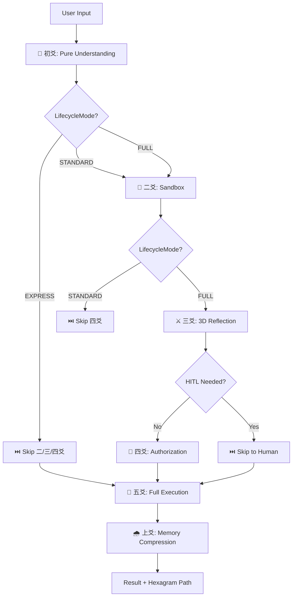

# 🏗️ Engineering Mapping — I Ching Concepts ↔ Modern System Architecture

> **Bridging ancient wisdom and modern engineering.**
> This mapping table helps engineers without I Ching background understand the
> practical engineering value behind the 六爻 (Six Lines) framework.

## Quick Reference Table

| Modern Engineering Concept | 易經 (I Ching) Concept | Yi-Jing Agent Implementation |
|:--------------------------|:-----------------------|:-----------------------------|
| **Stage-gated Finite State Machine** | 六爻時位 (Six Yao Positions) | [`YaoPosition`](../src/yi_jing_agent/yao_positions.py) — 6 ordered stages with strict forward-only progression |
| **Requirement Analysis Phase (NO actions)** | 初爻：潛龍勿用 (Hidden Dragon) | [`_parse_intent()`](../src/yi_jing_agent/executor.py#L77) — Pure understanding, zero tool calls |
| **Sandbox / Prototyping Phase** | 二爻：見龍在田 (Dragon in Field) | [`_sandbox_prototype()`](../src/yi_jing_agent/executor.py#L91) — Isolated feasibility testing |
| **Safety Review & Reflection Gate** | 三爻：終日乾乾 (Alert Dragon) | [`_reflexion_gate()`](../src/yi_jing_agent/executor.py#L107) — Mandatory 3D reflection before execution |
| **Human-in-the-Loop Authorization** | 四爻：或躍在淵 (Leaping Dragon) | [`_request_authorization()`](../src/yi_jing_agent/executor.py#L124) + [`AuthorizationLevel`](../src/yi_jing_agent/yao_positions.py#L33) |
| **Full Execution Phase** | 五爻：飛龍在天 (Flying Dragon) | [`_execute_master()`](../src/yi_jing_agent/executor.py#L134) — with retry, timeout, fallback |
| **Post-mortem & Memory Persistence** | 上爻：亢龍有悔 (Regretful Dragon) | [`_memory_compression()`](../src/yi_jing_agent/executor.py#L151) — Evaluate → Compress → Store to LTM |
| **Dynamic Fault Tolerance (XOR Strategy Switch)** | 動爻變卦 (Moving Line Mutation) | [`trigger_moving_yao()`](../src/yi_jing_agent/agent_state.py#L122) — XOR flip bit → lookup new hexagram strategy |
| **Predefined Failure Mode Lookup Table** | 64 卦策略表 (64 Hexagram Strategies) | [`STRATEGIES`](../src/yi_jing_agent/hexagram_table.py#L76) — 64 × (error pattern → recovery strategy) |
| **Single-bit Error Recovery** | XOR 翻轉 (XOR Bit Flip) | `code_list[yao_index - 1] = "0" if ... else "1"` — Deterministic local fault handling |
| **Multi-dimensional Review Engine** | 錯綜互卦 (3D Reflection) | [`ThreeDimensionalReflection`](../src/yi_jing_agent/reflection.py#L30) — 3 views: adversarial, user, hidden motive |
| **Red Team / Adversarial Testing** | 錯卦 (Opposite Hexagram) | [`analyze_opposite()`](../src/yi_jing_agent/reflection.py#L64) — Bitwise NOT of hexagram code |
| **User Perspective / UX Testing** | 綜卦 (Reversed Hexagram) | [`analyze_reversed()`](../src/yi_jing_agent/reflection.py#L86) — 180° string reversal of hexagram |
| **Hidden Motive / Deep Need Analysis** | 互卦 (Interlocking Hexagram) | [`analyze_interlocking()`](../src/yi_jing_agent/reflection.py#L43) — 2-3-4 + 3-4-5 yao composition |
| **Binary State Encoding (6-bit)** | 陰陽二進制 (Yin-Yang Binary) | `self.hexagram_code: str = "111111"` — 6-bit state of current task |
| **Explore vs. Exploit Trade-off** | 陰陽平衡 (Yin-Yang Balance) | Each hexagram strategy encodes an explore/exploit bias |
| **Execution Mode Selector** | LifecycleMode (生命週期模式) | [`LifecycleMode`](../src/yi_jing_agent/agent_state.py#L5) — EXPRESS / STANDARD / FULL |
| **Fast Path (skip sandbox + reflection + auth)** | EXPRESS 模式 | Skip 二爻(沙盒) + 三爻(反思) + 四爻(授權) — for trivial read-only tasks |
| **Standard Path (skip auth only)** | STANDARD 模式 | Skip 四爻(授權) only — for medium-risk auto tasks |
| **Full Path (all 6 stages)** | FULL 模式 | Execute all 6 yao positions — for high-risk/complex tasks |
| **Spiral Recursion Lifecycle** | 周流六虛 (Cyclical Return) | Complete 6 stages → compress → next level: `execute()` loop pattern |
| **Happy Path / Normal Execution** | ䷀ 乾為天 (Pure Yang) | Hexagram `111111` — "Everything OK, continue execution" |
| **Complete Failure / Human Takeover** | ䷁ 坤為地 (Pure Yin) | Hexagram `000000` — "Full collapse, hand over to human" |
| **Structured Task Decomposition** | 初爻輸出：Task Graph | [`TaskGraph`](../src/yi_jing_agent/agent_state.py#L10) — intent + constraints + criteria + forbidden actions |
| **Risk Assessment Document** | 二爻輸出：Feasibility Report | [`FeasibilityReport`](../src/yi_jing_agent/agent_state.py#L21) — APIs, tokens, risks, fallbacks |
| **Safety Check Result** | 三爻輸出：Safety Report | [`SafetyReport`](../src/yi_jing_agent/agent_state.py#L31) — passed, issues, recommendations, requires_human |

## Lifecycle Flow Diagram (Mermaid)

## FAQ

### Q: Why I Ching and not just a standard FSM?
A standard FSM requires the engineer to manually design every state transition. The I Ching provides **64 pre-defined strategies** — each hexagram encodes a domain-specific recovery/adaptation pattern. You don't design the transition logic; you **select from a battle-tested library** of 64 strategic responses.

### Q: Is this just mysticism wrapped in engineering jargon?
No. The I Ching is used as a **formal symbolic system**:
- 6-bit binary encoding → 64 unique states (mathematically complete)
- XOR bit flip → deterministic state transition (no randomness)
- Each strategy has explicit engineering semantics (rate limit, retry, degrade, human takeover)
- Tested with 222+ unit tests and CI pipeline

### Q: How is this different from LangGraph / CrewAI / AutoGPT?
| Framework | Approach | Fault Tolerance | Reflection |
|:----------|:---------|:----------------|:-----------|
| LangGraph | Graph-based DAG | Manual error nodes | Optional |
| CrewAI | Role-based agents | try/except per agent | Optional |
| AutoGPT | Continuous loop | Automatic retry | Minimal |
| **Yi-Jing Agent** | **6-stage lifecycle + 64-strategy table** | **Automatic XOR-switch** | **Mandatory 3D (adversarial + UX + deep need)** |

### Q: Do I need to learn I Ching to use this?
No. The lifecycle can be used purely as a **Stage-gated FSM**:
- Use `FULL` mode for high-risk tasks → all 6 gates active
- Use `STANDARD` mode for medium-risk → skip authorization gate
- Use `EXPRESS` mode for trivial tasks → only understand → execute → compress
- The hexagram strategy table works automatically as a fallback mechanism

### Q: What Python version do I need?
Python 3.10+. No external dependencies required.

---

## See Also

- [Architecture Overview](architecture-overview.md) — English summary
- [六爻AI-Agent架構設計書](六爻AI-Agent架構設計書.md) — Full Chinese design document (60KB)
- [English Complete Guide](english-complete-guide.md) — 416-line English documentation
- [Source Code](../src/yi_jing_agent/) — Python implementation
