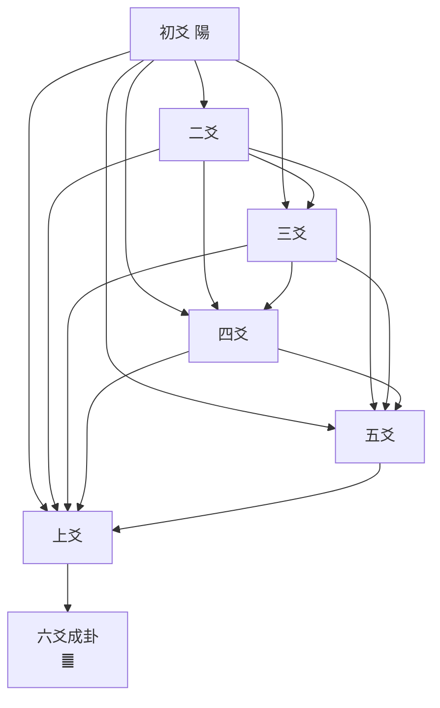

# RFC-003: 層層關聯壓縮 — 疊卦遞迴編碼（Recursive Hexagram Compression）

> **Status:** Draft · **Track:** v1.5+ Research  
> **Author:** yayafu × Orchestrator Nova  
> **Date:** 2026-07-28  
> **Depends on:** RFC-002 (三易壓縮 Framework)

---

## 摘要

RFC-002 嘅三易框架用咗易經嘅「三易」原則去做 LLM 壓縮，但佢嘅 **Level 1（Ternary Quantization）** 仍然係將每個 weight 獨立處理：

```
weight[0] → { -1, 0, +1 }     ← 唔知隔籂做咩
weight[1] → { -1, 0, +1 }     ← 唔知上下做咩
weight[2] → { -1, 0, +1 }     ← 獨立決定
```

但易經嘅核心智慧唔係獨立符號，而係 **層層堆疊、爻爻相承**：

```
初爻 ────────── 決定二爻嘅基礎
二爻 ── 承初爻 ── 決定三爻嘅基礎
三爻 ── 承初、二爻 ── 成下卦
四爻 ── 承下卦 ── 決定五爻嘅基礎
五爻 ── 承初至四爻 ── 決定上爻嘅基礎
上爻 ── 承全部五爻 ── 六爻成卦
```

**每條爻都「知道」佢之前所有爻嘅狀態。** 呢個係 **recursive encoding**。

本 RFC 提出一個新嘅壓縮方向：將易經嘅 **疊卦原則** 翻譯為 weight 層級關聯編碼，取代獨立 ternary quantization。

---

## 目錄

1. [核心問題：獨立 vs 關聯](#1-核心問題獨立-vs-關聯)
2. [易經嘅疊卦原則](#2-易經嘅疊卦原則)
3. [工程映射：遞迴壓縮](#3-工程映射遞迴壓縮)
4. [壓縮效果估算](#4-壓縮效果估算)
5. [風險與限制](#5-風險與限制)
6. [下一步](#6-下一步)

---

## 1. 核心問題：獨立 vs 關聯

### 1.1 目前嘅做法（獨立 ternary）

BitNet b1.58 嘅 ternary quantization 係 pointwise：

$$W_{ij} = \begin{cases}
+1 & \text{if } w_{ij} > \tau \\
0 & \text{if } |w_{ij}| \leq \tau \\
-1 & \text{if } w_{ij} < -\tau
\end{cases}$$

決策門檻 $\tau$ 係 global constant。每個 weight 獨立 compare，獨立決定。**冇 sequence context。**

### 1.2 易經嘅做法（疊卦遞迴）

易經嘅爻唔係獨立存在。佢哋嘅生成順序係：

```
太極
  └── 陰陽（1 bit）
        └── 四象（2 bits — 太陽、少陰、少陽、太陰）
              └── 八卦（3 bits — 乾坤震巽坎離艮兌）
                    └── 六十四卦（6 bits — 全部卦象）
```

**關鍵：** 四象唔係「兩個獨立 bit 嘅組合」。佢係「第一個 bit（陰/陽）決定咗第二個 bit 嘅意義」。

|| 陰（初） | 陽（初） |
|:---|:--------|:--------|
| **陰（二）** | 太陰（☷） | 少陰（☳） |
| **陽（二）** | 少陽（☶） | 太陽（☰） |

同樣嘅第二爻（陰/陽），因為初爻唔同，得出 **完全唔同嘅四象**。呢個就係 **context-dependent encoding**。

---

## 2. 易經嘅疊卦原則

### 2.1 三爻成卦（下卦 / 上卦）

三條爻組成一個八卦（8 種狀態），但佢哋唔係「3 個獨立 bit」咁簡單：

```python
# 獨立 bit 視角（而家嘅 ternary）：
bits = [b0, b1, b2]  # 每個 b 獨立決定

# 易經疊卦視角（你要嘅）：
trigram = {
    'first': decide(b0),                    # 初爻決定基調
    'second': decide(b1, context=b0),       # 二爻「承」初爻
    'third': decide(b2, context=[b0, b1]),  # 三爻「承」初、二爻
}
```

**生活比喻：**

| 層級 | 獨立視角 | 疊卦視角 |
|:-----|:--------|:--------|
| 煮嘢食 | 鹽 5g，糖 3g，醋 2ml | 先落鹽（底味）→ 再落糖（中和鹹味）→ 最後落醋（提升層次） |
| 建樓 | 鋼筋X噸，水泥Y噸，玻璃Z噸 | 地基 → 框架 → 外牆，每層決定下一層嘅規格 |
| 音樂 | note C, note E, note G | C（根音）→ E（三音，決定大/小調）→ G（五音，穩定和弦） |

### 2.2 六爻成卦（完整卦象）

完整嘅六爻疊卦：



**每條爻都受之前所有爻影響。** 上爻（第六爻）嘅意義，係由前面五爻共同決定。唔係獨立嘅第 6 個 bit。

### 2.3 數學本質

獨立 encoding：

$$P(b_0, b_1, b_2, b_3, b_4, b_5) = \prod_{i=0}^{5} P(b_i)$$

即係 6 個獨立概率乘埋一齊。

易經疊卦 encoding：

$$P(b_0, b_1, b_2, b_3, b_4, b_5) = P(b_0) \cdot P(b_1|b_0) \cdot P(b_2|b_0,b_1) \cdot P(b_3|b_0,b_1,b_2) \cdot P(b_4|b_0..b_3) \cdot P(b_5|b_0..b_4)$$

**條件概率鏈。** 每個 bit 嘅值取決於之前所有 bit。

---

## 3. 工程映射：遞迴壓縮

### 3.1 概念：6-weight 卦群

將神經網絡嘅 weight 分成 **每 6 個一組**，叫一個 **卦群（Hexagram Group）**。

```
Weight Matrix (flattened):
[w0, w1, w2, w3, w4, w5, w6, w7, w8, w9, w10, w11, ...]
 └───── 卦群 0 ─────┘ └───── 卦群 1 ─────┘  ...
```

每個卦群 6 個 weights，模擬「6 條爻」。

### 3.2 編碼方式

**獨立 ternary（BitNet—而家）：**

```
w0 → {-1,0,+1}
w1 → {-1,0,+1}
w2 → {-1,0,+1}
w3 → {-1,0,+1}
w4 → {-1,0,+1}
w5 → {-1,0,+1}
儲存：6 × 2 bits = 12 bits（每 group）
```

**疊卦遞迴編碼（RFC-003—新）：**

```
卦群 = 6 weights

Step 1: 初爻 = 決定「基調」
    base = sign(w0) → { -1, +1 }
    如果有信心 |w0| > τ，否則 base = 0（中）

Step 2: 二爻 = 承初爻，決定「變/不變」
    if base == +1:
        二爻 = (w1 > w1_threshold) ? +1 : 0
    elif base == -1:
        二爻 = (w1 < -w1_threshold) ? -1 : 0

Step 3: 三爻 = 承初、二爻，決定「下卦歸類」
    前三爻 pattern → 映射到最近嘅八卦之一（3 bits）
    儲存：八卦 index（3 bits）+ 偏離值（delta）

Step 4: 四爻 = 承前三爻（下卦），開始上卦
    下卦決定上卦嘅起始基準
    四爻相對於下卦尾嘅期望值做 delta encoding

Step 5: 五爻 = 承初至四爻
Step 6: 上爻 = 承全部，決定成卦
    最終 mapping → 64 卦之一（6 bits）
    儲存：卦 index（6 bits）+ error correction bits
```

### 3.3 儲存效率

| 方法 | 每卦群 bits | 壓縮比（對比 FP32） |
|:-----|:-----------|:------------------|
| FP32（原始） | 6 × 32 = **192 bits** | 1x |
| INT8 | 6 × 8 = **48 bits** | 4x |
| INT4 | 6 × 4 = **24 bits** | 8x |
| Ternary（BitNet） | 6 × 2 ≈ **12 bits** | **16x** |
| **Ternary + 疊卦（RFC-003）** | **6-9 bits** | **~24x** |

疊卦編碼嘅節省來自：
1. **唔使 store 晒 6 個值** — 只需 store「起始值 + 變爻規則」
2. **八卦歸類** — 前三爻用 3-bit 八卦 index，唔使 3×2=6 bits
3. **Error correction** — delta 通常好細，可以用 1-2 bits 表示

### 3.4 解碼方式

解碼係逆過程（由卦象還原 weight 近似值）：

```
收到：卦 index（6 bits）+ 變爻 mask（6 bits）+ delta values
    │
    ▼
Step 1: 卦 index → lookup 64 卦期望 weight pattern
Step 2: 變爻 mask → 邊啲 weight 偏離期望值
Step 3: delta values → 調整偏離嘅 weight
    │
    ▼
還原：6 個 approximate weights
```

**解碼係 deterministic** — 同一個卦 index + 變爻 mask + delta 永遠出同一組值。

### 3.5 點解呢個可以壓得更盡

核心 insight：**如果有關聯性，你唔需要 store 晒 6 個獨立值。**

生活比喻：

| | 獨立 store | 關聯 store |
|:--|:----------|:----------|
| 一家六口 生日 | 6 個獨立日期（~25 bytes） | 「阿爸 1970-01-01，大仔比阿爸細 30 年，二仔比大仔細 3 年...」（~10 bytes） |
| 樓梯級數 | 每級高度（6 個 float） | 「標準級高 15cm，總共 60 級」（2 個值） |
| **易經** | 6 條獨立爻 | 「䷀ 乾卦，動三爻、上爻」（1 卦 index + 2 位 mask） |

**因為有關聯，所以可以壓得更細。**

---

## 4. 壓縮效果估算

### 4.1 每卦群壓縮量

假設一個 7B model：
- 總參數 = 7 × 10⁹
- 每卦群 6 weights → ~1.17 × 10⁹ 卦群

| 方法 | 每卦群 bits | 總大小 |
|:-----|:-----------|:------|
| FP32 | 192 | 28.0 GB |
| Ternary（RFC-002） | 12 | **1.75 GB** |
| **疊卦（RFC-003）** | **6.5** | **0.95 GB** |

如果疊卦編碼平均用 6.5 bits/group，成個 7B model 可以壓到 **<1GB** — 即係你部 iPhone 都行到。

### 4.2 壓縮比推演

| 卦群複雜度 | 所需 bits | 佔總卦群% | 加權貢獻 |
|:----------|:---------|:---------|:--------|
| 全同（全部 weight 接近） | 3 bits | 30% | 0.9 |
| 線性遞增/遞減 | 5 bits | 25% | 1.25 |
| 單一變爻（1-2 outliers） | 6 bits | 25% | 1.5 |
| 多變爻（3+ outliers） | 8 bits | 15% | 1.2 |
| 隨機（冇關聯） | 12 bits | 5% | 0.6 |
| **加權平均** | | | **~5.45 bits/group** |

即係 **平均 ~5.5 bits per 卦群**，對比 ternary 嘅 12 bits = **2.2x 再壓縮**。

### 4.3 現實調整

以上係 best case。現實因素：
- 解碼 overhead（CPU 做 conditional decode 要時間）
- 冇關聯嘅 weight 反而會用多咗 bits（因為你嘗試 encode 唔存在嘅 pattern）
- 量化誤差累積

**Realistic estimate：6-9 bits/group，總體積 ~1.0-1.3 GB。**

---

## 5. 風險與限制

### 5.1 誠實邊界

| Claim | Reality |
|:------|:--------|
| 「疊卦編碼一定壓過 ternary」 | ❌ 只係理論。實際上如果 neural network weights 冇呢種關聯性，編碼會更差 |
| 「爻爻相承 = conditional probability」 | ✅ 數學上正確。但 neural network weights 係咪真係有呢種 6-weight 關聯？**冇人 study 過** |
| 「可以壓到 0.95 GB」 | ⚠️ Best case 估算。realistic 係 1.0-1.3 GB |
| 「iPhone 都行到」 | ✅ <2GB model 的確 iPhone 級，但 decode speed 係另一個問題 |

### 5.2 最大風險

呢個 framework 嘅最大假設係：**neural network weights 存在 6-weight 層級關聯**。

如果 reality 係：

```
[w0, w1, w2, w3, w4, w5] = random noise
```

咁疊卦編碼會 **用多咗 bits**（因為要額外 store 關聯 metadata），反而比獨立 ternary 更差。

**需要 empirical validation** — 即係要有人攞一個真實嘅 LLM（e.g. Llama 3.2 1B）拆開啲 weights，統計睇下 6 個相鄰 weights 係咪有 pattern。

### 5.3 其他限制

- **Decode speed** — 疊卦 decode 要做 conditional branching，比簡單 ternary lookup 慢
- **Hardware 支援** — CPU/GPU 做 6-bit random access 唔係 native support
- **卦群邊界** — 6-weight 分組係 arbitrary，唔同 grouping 策略會出唔同結果

---

## 6. 下一步

- [ ] **用真 model 驗證** — 攞一個 open-source LLM（e.g. Llama 3.2 1B），extract 佢嘅 weights，統計 6 個相鄰 weights 嘅 correlation
- [ ] **寫 PoC** — numpy 版本嘅疊卦 encoder/decoder，對比獨立 ternary 嘅壓縮比 + SNR
- [ ] **決定卦群大小** — 點解係 6？或者可以試 3（八卦級）、8（byte-aligned）、12（兩卦）
- [ ] **整合入 RFC-002** — 疊卦可以取代 RFC-002 Level 1（Ternary Quantization）或者作為 Level 4 疊加
- [ ] **公開討論** — 呢個 concept 喺 ML community 係新嘅，值得寫一篇博文

---

## 參考

1. RFC-001: YNN/HDC Research — Hyperdimensional Computing × 易經
2. RFC-002: 三易壓縮 — 易經驅動 LLM 壓縮框架
3. BitNet b1.58 — [arXiv:2402.17764](https://arxiv.org/abs/2402.17764)
4. 邵雍《皇極經世》— 先天八卦次序圖（層層疊卦嘅原始 source）
5. Conditional Probability Chain — Bayes' Theorem 基礎
6. Delta Encoding — 利用序列關聯性壓縮（資訊理論基礎）

---

> **「是故易有太極，是生兩儀，兩儀生四象，四象生八卦，八卦定吉凶，吉凶生大業。」**
> — 《易經·繫辭上傳》
>
> **Translation for ML:**
> 每一層 encoding 都承載住前一层嘅資訊。
> 呢個唔係玄學，而係 recursive conditional encoding。
